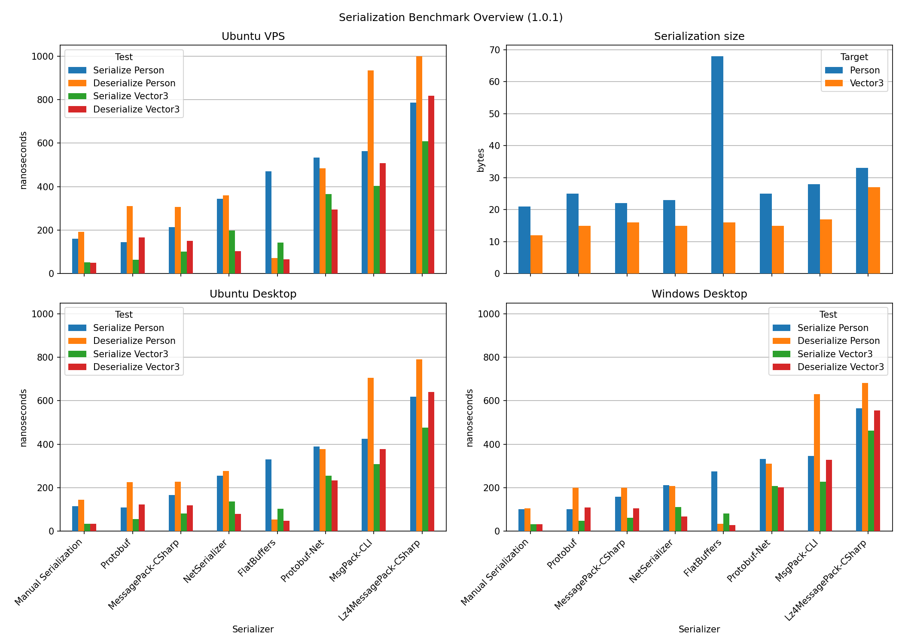
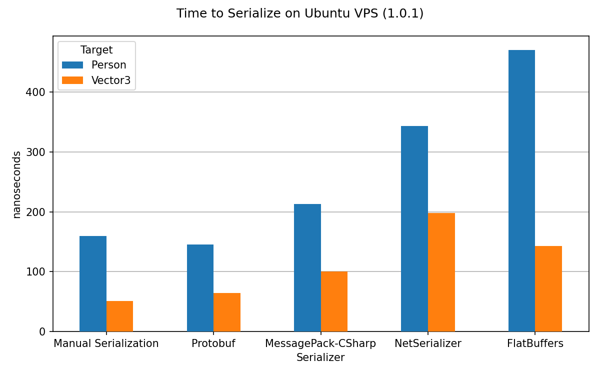
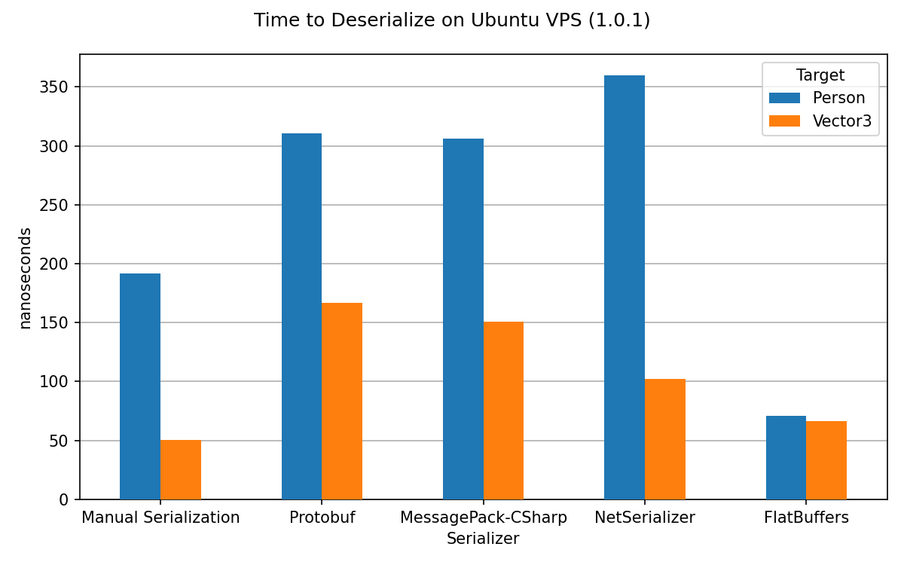
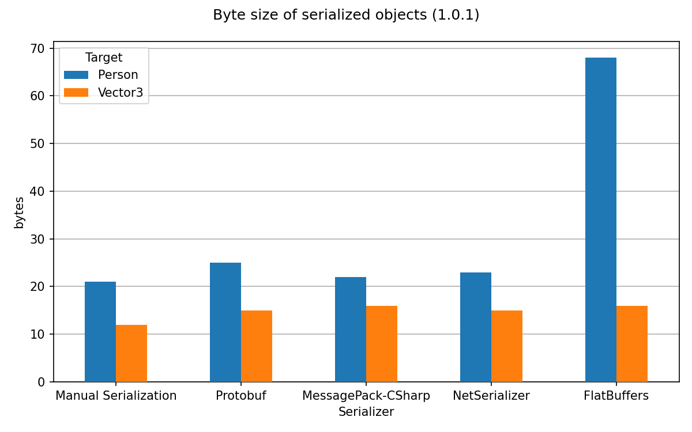

# Serialization Benchmark .NET

*Benchmark for different serialization libraries for .NET 6*


[](../../releases) [](https://dotnet.microsoft.com/download/dotnet/6.0)

## Description

This benchmark compares serialization times, deserialization times and serialization size of different libraries. The benchmark aims to be easily extensible for other serialization targets, while painting an objective picture of the most common serializers for .NET. Additionally, it also compares serializers against manual serialization.

## Libraries

* Manual Serialization with [BitPackingTools](https://github.com/emotitron/BitpackingTools)
* [Protobuf](https://github.com/protocolbuffers/protobuf) (v23.0)
* [MessagePack-CSharp](https://github.com/neuecc/MessagePack-CSharp) (v2.5.108)
* [NetSerializer](https://github.com/tomba/netserializer) (v4.1.2)
* [FlatBuffers](https://github.com/google/flatbuffers) (v23.5.9 - master [14725d6](https://github.com/google/flatbuffers/commit/72b56fd0810c9a6cd38ea1c8f40feaa1bb4916b1))
* [Protobuf-Net](https://github.com/protobuf-net/protobuf-net) (v3.2.16)
* [MsgPack-CLI](https://github.com/msgpack/msgpack-cli) (v1.0.1)
* [Newtonsoft.Json](https://github.com/JamesNK/Newtonsoft.Json) (v13.0.3)
* [Utf8Json](https://github.com/neuecc/Utf8Json) (v1.3.7)

## Benchmarks


The benchmarks were run with three different setups. The results are shown in the charts above. Newtonsoft.Json was removed from this results, since it takes significantly more time for serialization and deserialization and would have made the chart hard to read.

### Hardware

* Ubuntu VPS
  * Virtual private server with dedicated CPU's running - [Hardware](https://www.netcup.eu/bestellen/produkt.php?produkt=2624)
  * Ubuntu 20.04.3 LTS x86-64 Kernel 5.14.0-051400-generic

* Ubuntu Desktop / Windows Desktop
  * Desktop PC from 2020 - [Hardware](https://pcpartpicker.com/user/JohannesDeml/saved/zz7yK8)
  * Windows 10 Pro x86-64 Build 19043.1266 (21H1/May2021Update)
  * Ubuntu 20.04.3 LTS x86-64 Kernel 5.11.0-37-generic

### Software

* [.NET](https://dotnet.microsoft.com/download/dotnet) 5.0.11 (5.0.1121.47308)
* [BenchmarkDotNet](https://github.com/dotnet/BenchmarkDotNet) 0.13.1

### Targets
* Person: Class with 2 variable length strings, one byte for age and enum Sex with three values
* Vector 3: Struct with 3 floats

### Results
Here are the results from the 5 most promising libraries. All other results can be seen in the overview chart above or can be analyzed in the raw results from the release section. The results presented here are from the Ubuntu VPS setup. The results are cleaned by substracting the retrieved benchmark overhead.  

You can find the raw data of the results in the [release section](../../releases).

The benchmarks are generated with [BenchmarkDotNet](https://github.com/dotnet/BenchmarkDotNet). The results are generated from version 1.0.0

``` ini
BenchmarkDotNet=v0.12.1, OS=ubuntu 20.04
AMD EPYC 7702P, 1 CPU, 4 logical and 4 physical cores
.NET Core SDK=5.0.202
  [Host]     : .NET Core 5.0.5 (CoreCLR 5.0.521.16609, CoreFX 5.0.521.16609), X64 RyuJIT
  Job-TIPVXW : .NET Core 5.0.5 (CoreCLR 5.0.521.16609, CoreFX 5.0.521.16609), X64 RyuJIT

Platform=X64  Runtime=.NET Core 5.0  Concurrent=True  
Force=False  Server=True  IterationTime=250.0000 ms  
MaxIterationCount=20  MinIterationCount=15  UnrollFactor=8  
WarmupCount=3  Version=1.0.0  OS=Linux 5.4.0-72-generic #80-Ubuntu SMP Mon Apr 12 17:35:00 UTC 2021  
DateTime=04/30/2021 11:07:23  SystemTag=Ubuntu VPS  
```

#### Serialization

#### Deserialization

#### Serialization Size


### Reproduce

Make sure you have [.Net 6 SDK](https://dotnet.microsoft.com/download) installed.  

You can reproduce the results by running `linux-benchmark.sh` on Linux or `win-benchmark.bat` on Windows. The benchmarks will take about 5 minutes to complete.

## Contribute

Do you think a Serializer is missing or want to add a different serialization target? Let's evolve this benchmark together! Either hit me up via [E-mail](mailto:public@deml.io) to discuss your idea, or [open an issue](../../issues), or make a pull request directly. There are a few rules in order to not make the benchmark too cluttered.

### Adding a Library

Make sure your library is either popular or can compete with the serialization seed of the selected libraries. The library also needs to be .NET5 compatible and should be interesting for others.

If your library is available through nuget, add it to the main project through nuget. Otherwise, add a new project and either include a https submodule, or a copy of the repo with a note, which commit was used.

Implement the Serialize logic in the class `./SerializationBenchmarkDotNet/Serializer/YourSerializationLibraryName.cs`. This class should either inherit from `ADirectSerializer` if it uses the `Person.cs` and `Vector3.cs` directly, or `ASerializer` if it creates another format it deserializes to. Take a look at the other serializers to get an idea on how to implement your library.

To test your library, just add it to the list of Serializers in `SerializationBenchmark.cs`. You can debug your serializer by switching to the debug setting. This way, the benchmark will be run in the same process and only once per combination. Make sure your serializer manages to serialize and deserialize all targets and returns the correct serialization sizes.

### Adding a Target

The new target should create interesting results. Either, it shows that a library is better at something that another thing, or it covers a space which is currently not covered by the existing targets.

Implement the target class in `./SerializationBenchmarkDotNet/SerializationTargets/YourTarget.cs`. The class has to implement `IEquatable<Person>, ISerializationTarget`.  To test your library, just add it to the list of Targets in `SerializationBenchmark.cs`. Make sure, all serializers can handle your new target. You will need to add custom code apart from attributes for some libraries (Manual serialization, FlatBuffers, Protobuf).

You can debug your serializer by switching to the debug setting. This way, the benchmark will be run in the same process and only once per combination. Make sure, each library generates serialization and deserialization times. If a library creates wrong results, it will throw an error and therefore no time will be generated.

## License

[MIT](./LICENSE)